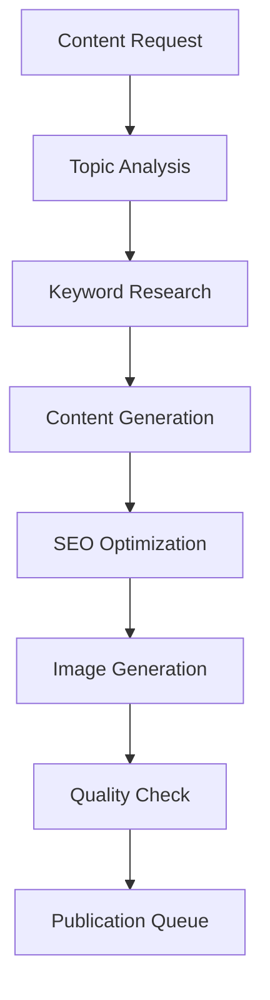

# AI Content Generation System Documentation

## Overview

The Pishkhanak platform features a sophisticated AI content generation system that automates blog post creation, image generation, and SEO optimization using multiple AI providers including Google Gemini, OpenAI, and specialized image generation services.

## Architecture

### Core Services

#### 1. AiService (`app/Services/AiService.php`)
The central service orchestrating all AI operations:
- Content generation coordination
- Provider selection and fallback
- Quality assurance and validation
- Integration with content pipeline

#### 2. GeminiService (`app/Services/GeminiService.php`)
Google Gemini AI integration:
- Blog content generation
- SEO optimization
- Content enhancement
- Multi-language support

#### 3. ContentEnhancementService (`app/Services/ContentEnhancementService.php`)
Content improvement and optimization:
- SEO meta tag generation
- Readability enhancement
- Keyword optimization
- Content structure improvement

#### 4. ImageGenerationService (`app/Services/ImageGenerationService.php`)
AI-powered image creation:
- Thumbnail generation
- Feature image creation
- Custom graphics generation
- Image optimization

## Content Generation Pipeline

### 1. Blog Content Creation Flow



### 2. Process Steps

#### Step 1: Topic Analysis
```php
// Analyze content requirements
$analyzer = new ContentAnalyzer();
$topicData = $analyzer->analyze($title, $keywords, $category);
```

#### Step 2: Content Generation
```php
// Generate blog content using Gemini
$gemini = new GeminiService();
$content = $gemini->generateBlogPost([
    'title' => $title,
    'keywords' => $keywords,
    'tone' => 'professional',
    'length' => 'detailed',
    'language' => 'persian'
]);
```

#### Step 3: SEO Enhancement
```php
// Enhance content for SEO
$enhancer = new ContentEnhancementService();
$optimizedContent = $enhancer->optimizeForSEO($content, [
    'target_keywords' => $keywords,
    'meta_description' => true,
    'structured_data' => true
]);
```

#### Step 4: Image Generation
```php
// Generate accompanying images
$imageService = new ImageGenerationService();
$thumbnail = $imageService->generateThumbnail($content['title']);
$featuredImage = $imageService->generateFeaturedImage($content['summary']);
```

## AI Models and Providers

### 1. Google Gemini
**Use Cases:**
- Long-form content generation
- Persian language content
- Technical explanations
- SEO optimization

**Configuration:**
```php
// config/ai.php
'gemini' => [
    'api_key' => env('GEMINI_API_KEY'),
    'model' => 'gemini-pro',
    'temperature' => 0.7,
    'max_tokens' => 4000
]
```

### 2. OpenAI GPT
**Use Cases:**
- Content refinement
- Translation services
- Creative writing
- Code documentation

**Configuration:**
```php
'openai' => [
    'api_key' => env('OPENAI_API_KEY'),
    'model' => 'gpt-4',
    'temperature' => 0.8,
    'max_tokens' => 3000
]
```

### 3. OpenRouter
**Use Cases:**
- Model comparison
- Fallback provider
- Specialized model access
- Cost optimization

## Content Pipeline Management

### 1. BlogContentPipeline Model
Manages the content generation workflow:

```php
class BlogContentPipeline extends Model
{
    protected $fillable = [
        'title',
        'keywords',
        'category_id',
        'status',
        'generated_content',
        'seo_data',
        'images',
        'scheduled_at'
    ];

    protected $casts = [
        'keywords' => 'array',
        'seo_data' => 'array',
        'images' => 'array',
        'scheduled_at' => 'datetime'
    ];
}
```

### 2. Processing Status Tracking
```php
// Status enum
enum ContentStatus: string
{
    case PENDING = 'pending';
    case GENERATING = 'generating';
    case ENHANCING = 'enhancing';
    case GENERATING_IMAGES = 'generating_images';
    case REVIEW = 'review';
    case PUBLISHED = 'published';
    case FAILED = 'failed';
}
```

## Admin Interface Integration

### 1. Filament Resources
The system integrates with Filament admin panel:

#### AiContentResource
- Content generation interface
- Progress monitoring
- Manual review and editing
- Publication scheduling

#### BlogPipelineResource
- Batch content generation
- Pipeline status dashboard
- Performance analytics
- Error handling

### 2. Real-time Updates
Using Laravel Reverb for live updates:

```php
// Broadcasting content generation progress
broadcast(new ContentGenerationProgress($pipeline->id, $status));

// Frontend listener
Echo.channel('content-pipeline')
    .listen('ContentGenerationProgress', (e) => {
        updateProgress(e.pipelineId, e.status);
    });
```

## Quality Assurance

### 1. Content Validation
```php
class ContentValidator
{
    public function validate($content): ValidationResult
    {
        return new ValidationResult([
            'readability_score' => $this->calculateReadability($content),
            'seo_score' => $this->calculateSeoScore($content),
            'originality_score' => $this->checkOriginality($content),
            'language_quality' => $this->assessLanguage($content)
        ]);
    }
}
```

### 2. Automated Review
- Duplicate content detection
- Grammar and spelling checks
- SEO compliance verification
- Brand guideline adherence

## Configuration

### 1. AI Settings Model
Database-driven configuration:

```php
class AiSetting extends Model
{
    protected $fillable = [
        'provider',
        'model',
        'parameters',
        'is_active',
        'priority'
    ];

    protected $casts = [
        'parameters' => 'array',
        'is_active' => 'boolean'
    ];
}
```

### 2. Environment Variables
```env
# AI Service Configuration
AI_DEFAULT_PROVIDER=gemini
AI_FALLBACK_PROVIDER=openai
AI_MAX_RETRIES=3
AI_TIMEOUT=120

# Provider API Keys
GEMINI_API_KEY=your_gemini_key
OPENAI_API_KEY=your_openai_key
OPENROUTER_API_KEY=your_openrouter_key

# Content Settings
AI_CONTENT_MIN_LENGTH=500
AI_CONTENT_MAX_LENGTH=3000
AI_CONTENT_LANGUAGE=persian
```

## Background Processing

### 1. Queue Jobs
```php
// Generate content in background
dispatch(new GenerateAiContentJob($pipeline));

// Process images
dispatch(new GenerateContentImagesJob($pipeline));

// Publish content
dispatch(new PublishContentJob($pipeline));
```

### 2. Job Classes
- `GenerateAiContentJob`: Main content generation
- `GenerateContentImagesJob`: Image creation
- `OptimizeContentJob`: SEO and readability optimization
- `PublishContentJob`: Final publication
- `ContentQualityCheckJob`: Automated review

## Performance Optimization

### 1. Caching Strategy
```php
// Cache generated content
Cache::tags(['ai-content', "pipeline-{$id}"])
    ->put("content-{$id}", $content, now()->addHours(24));

// Cache AI responses
Cache::remember("ai-response-{$hash}", 3600, fn() => $aiService->generate($prompt));
```

### 2. Rate Limiting
```php
// Implement rate limiting for AI APIs
RateLimiter::for('ai-content', function (Request $request) {
    return Limit::perMinute(10)->by($request->user()?->id ?: $request->ip());
});
```

## Monitoring and Analytics

### 1. Performance Metrics
- Generation time per content piece
- API response times
- Success/failure rates
- Cost tracking per provider

### 2. Content Analytics
- Engagement metrics
- SEO performance
- User interaction data
- Content quality scores

## Error Handling

### 1. Retry Logic
```php
class AiServiceWithRetry
{
    public function generateWithRetry($prompt, $maxRetries = 3)
    {
        return retry($maxRetries, function () use ($prompt) {
            return $this->generate($prompt);
        }, 1000); // 1 second delay between retries
    }
}
```

### 2. Fallback Providers
```php
// Automatic fallback to alternative providers
try {
    $content = $this->geminiService->generate($prompt);
} catch (ApiException $e) {
    $content = $this->openaiService->generate($prompt);
}
```

## Usage Examples

### 1. Generate Blog Post
```php
use App\Services\AiService;

$aiService = new AiService();

$blogPost = $aiService->generateBlogPost([
    'title' => 'مزایای استعلام IBAN آنلاین',
    'keywords' => ['IBAN', 'استعلام', 'بانکی', 'آنلاین'],
    'category' => 'banking-services',
    'tone' => 'informative',
    'target_audience' => 'general_public'
]);

// Generated content includes:
// - title
// - content (HTML formatted)
// - meta_description
// - keywords
// - featured_image_prompt
// - seo_score
```

### 2. Batch Content Generation
```php
use App\Models\BlogContentPipeline;

$topics = [
    'استعلام کد ملی',
    'بررسی وضعیت چک',
    'استعلام خلافی خودرو'
];

foreach ($topics as $title) {
    BlogContentPipeline::create([
        'title' => $title,
        'status' => 'pending',
        'keywords' => $this->extractKeywords($title),
        'scheduled_at' => now()->addMinutes(rand(1, 60))
    ]);
}

// Process queue
Artisan::call('queue:work');
```

## Troubleshooting

### Common Issues

1. **API Rate Limits**
   - Solution: Implement exponential backoff
   - Monitor usage quotas
   - Use multiple API keys

2. **Content Quality Issues**
   - Adjust temperature parameters
   - Improve prompt engineering
   - Implement human review workflow

3. **Image Generation Failures**
   - Fallback to stock images
   - Retry with simplified prompts
   - Use alternative providers

### Debug Commands
```bash
# Test AI service connectivity
php artisan ai:test-connection

# Generate sample content
php artisan ai:generate-sample

# Clear AI content cache
php artisan cache:tags ai-content --flush

# Monitor generation queue
php artisan queue:monitor ai-content
```

## Future Enhancements

### Planned Features
1. **Multi-modal Content**: Video and audio generation
2. **Personalization**: User-specific content adaptation
3. **A/B Testing**: Content variant generation and testing
4. **Advanced SEO**: Real-time SEO trend integration
5. **Content Localization**: Multi-region content adaptation

### Integration Roadmap
- WordPress plugin development
- API endpoints for external usage
- Mobile app integration
- Social media auto-posting
- Email newsletter generation