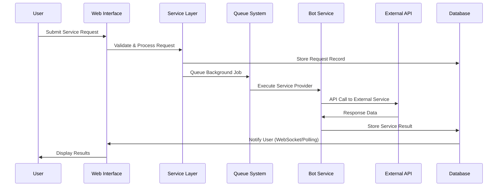
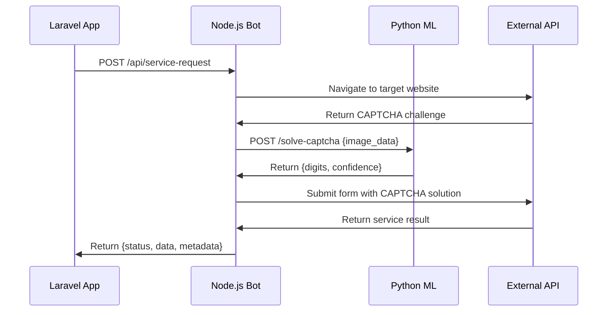

# 🏗️ Architecture Overview - Pishkhanak Platform

> **Multi-layered financial services platform with automated inquiry processing and AI-enhanced content generation**

## 📋 Table of Contents
- [Core Architecture](#core-architecture)
- [Application Layers](#application-layers)  
- [Data Architecture](#data-architecture)
- [Service Architecture](#service-architecture)
- [Bot Ecosystem](#bot-ecosystem)
- [Security Architecture](#security-architecture)
- [Performance & Scalability](#performance--scalability)

---

## 🏛️ Core Architecture

### **System Design Philosophy**
```
┌─────────────────────────────────────────────────────────┐
│                 PRESENTATION LAYER                      │
├─────────────────┬─────────────────┬─────────────────────┤
│   Web Interface │   Admin Panel   │   Telegram Bots     │
│   (Livewire)    │   (Filament)    │   (Bot API)         │
└─────────────────┴─────────────────┴─────────────────────┘
                         │
┌─────────────────────────────────────────────────────────┐
│                 APPLICATION LAYER                       │
├─────────────────┬─────────────────┬─────────────────────┤
│   Controllers   │   Middleware    │   Form Requests     │
│   (Web/API)     │   (Security)    │   (Validation)      │
└─────────────────┴─────────────────┴─────────────────────┘
                         │
┌─────────────────────────────────────────────────────────┐
│                  BUSINESS LAYER                         │
├─────────────────┬─────────────────┬─────────────────────┤
│   Services      │   Jobs & Events │   Rule Engine       │
│   (Logic)       │   (Processing)  │   (Validation)      │
└─────────────────┴─────────────────┴─────────────────────┘
                         │
┌─────────────────────────────────────────────────────────┐
│                   DATA LAYER                            │
├─────────────────┬─────────────────┬─────────────────────┤
│   Models        │   Repositories  │   Cache Layer       │
│   (Eloquent)    │   (Data Access) │   (Redis)           │
└─────────────────┴─────────────────┴─────────────────────┘
                         │
┌─────────────────────────────────────────────────────────┐
│                INFRASTRUCTURE LAYER                     │
├─────────────────┬─────────────────┬─────────────────────┤
│   Database      │   Queue System  │   Bot Services      │
│   (PostgreSQL)  │   (Redis)       │   (Node.js/Python) │
└─────────────────┴─────────────────┴─────────────────────┘
```

### **Technology Stack Rationale**

#### **Backend Framework: Laravel 11**
- **Modern PHP** (8.1-8.4 support) with latest language features
- **Robust Ecosystem** - Extensive package support for financial services
- **Persian Support** - Built-in localization and Verta calendar integration
- **Enterprise Features** - Queue system, event broadcasting, comprehensive ORM

#### **Database: PostgreSQL + Redis**
- **PostgreSQL** - ACID compliance for financial data integrity
- **Redis** - High-performance caching and session management
- **Queue Processing** - Redis-backed job system for background tasks

#### **Frontend Architecture**
- **Livewire 3** - Reactive components without complex JavaScript
- **Blade Templates** - Server-side rendering with component reusability  
- **TailwindCSS** - Utility-first styling with Persian RTL support
- **Alpine.js** - Minimal client-side interactions

---

## 🔧 Application Layers

### **Controller Architecture**
```php
app/Http/Controllers/
├── Web/                     # Frontend controllers
│   ├── PageController.php:19        # Home, about, contact
│   ├── ServiceController.php        # Service display and forms
│   └── UserController.php           # User dashboard and profile
├── Services/                # Specialized service controllers  
│   ├── LocalApiController.php:40    # Bot communication
│   └── LoanInquiryController.php    # Banking service integration
├── PaymentController.php:15         # Payment gateway handling
├── WebhookController.php           # External service webhooks
└── TelegramBotController.php:23    # Multi-bot management
```

#### **Key Controller Patterns**
- **Form Request Validation** - Centralized input validation and sanitization
- **Service Injection** - Business logic delegated to service layer
- **Response Formatting** - Consistent API responses across endpoints
- **Error Handling** - Graceful degradation with user-friendly messages

### **Service Layer Architecture**
```php
app/Services/
├── Payment/                 # Financial processing
│   ├── PaymentGatewayManager.php   # Multi-gateway orchestration
│   ├── JibitService.php            # Jibit gateway integration
│   └── CurrencyService.php         # Multi-currency support
├── AI/                     # Content generation
│   ├── OpenAIService.php:25        # GPT integration
│   ├── ImageGenerationService.php  # Midjourney/DALL-E
│   └── AiContentService.php        # Content pipeline management
├── Communication/          # External messaging
│   ├── SmsService.php:89           # Finnotech SMS integration
│   └── TelegramBotService.php      # Multi-bot coordination
└── Integration/            # External APIs
    ├── FinnotechTokenMapper.php    # API token management
    └── ServiceFormAnalyzer.php     # Dynamic form processing
```

#### **Service Design Principles**
- **Single Responsibility** - Each service handles one business domain
- **Interface Segregation** - Small, focused contracts for testability
- **Dependency Injection** - Loose coupling via Laravel's container
- **Error Boundary** - Service-level exception handling and logging

---

## 💾 Data Architecture

### **Model Relationships**
```php
Core Business Models:
├── User (46 relationships)         # Central user entity
├── Service (12 relationships)      # Service catalog and pricing
├── Transaction (8 relationships)   # Financial transaction tracking
├── Ticket (6 relationships)        # Support system integration
└── AiContent (4 relationships)     # Generated content management

Payment System:
├── GatewayTransaction              # Multi-gateway transaction log
├── PaymentGateway                  # Gateway configuration and status  
├── Currency                        # Multi-currency support
└── Wallet (Bavix integration)     # User wallet management

Support System:
├── Ticket → TicketCategory         # Hierarchical ticket organization
├── TicketMessage → User            # Multi-user conversation threads
├── TicketAttachment               # File upload support
└── TicketActivity                 # Audit trail and status tracking
```

#### **Database Design Patterns**
- **Soft Deletes** - Reversible data removal for audit compliance
- **UUID Primary Keys** - Distributed system compatibility  
- **Polymorphic Relations** - Flexible content and attachment systems
- **Index Strategy** - Query optimization for high-traffic endpoints

### **Data Flow Architecture**


---

## ⚙️ Service Architecture

### **Multi-Provider Pattern**
```php
interface ServiceProviderInterface {
    public function processInquiry(array $data): ServiceResult;
    public function isAvailable(): bool;
    public function getProviderName(): string;
}

class CreditScoreService {
    private array $providers = [
        'rade' => RadeProvider::class,
        'nics24' => Nics24Provider::class,
        'baman24' => Baman24Provider::class
    ];
    
    public function processWithFailover(array $data): ServiceResult {
        foreach ($this->providers as $name => $provider) {
            if ($provider->isAvailable()) {
                return $provider->processInquiry($data);
            }
        }
        throw new NoProvidersAvailableException();
    }
}
```

#### **Service Processing Flow**
1. **Request Validation** - Input sanitization and business rule validation
2. **Provider Selection** - Automatic failover between available providers  
3. **Background Processing** - Queue-based execution for scalability
4. **Result Caching** - Redis-based caching to prevent duplicate API calls
5. **User Notification** - Multi-channel notification (SMS, Telegram, Web)

### **Payment Gateway Architecture**
```php
abstract class PaymentGateway {
    abstract public function createTransaction(array $data): string;
    abstract public function verifyTransaction(string $transactionId): bool;
    abstract public function refundTransaction(string $transactionId): bool;
}

class PaymentGatewayManager {
    public function processPayment(PaymentRequest $request): PaymentResult {
        $gateway = $this->selectGateway($request->amount, $request->currency);
        return $gateway->createTransaction($request->toArray());
    }
    
    private function selectGateway(int $amount, string $currency): PaymentGateway {
        // Load balancing and failover logic
        // Returns: JibitGateway, SepGateway, or SamanGateway
    }
}
```

---

## 🤖 Bot Ecosystem

### **inquiry-provider Service** (Node.js)
**Location**: `bots/inquiry-provider/`
**Purpose**: Web scraping and external API integration
**Architecture**:
```javascript
// Core Components
├── localApiServer.js          # Express.js API server (port 9999)
├── services/                  # Provider implementations
│   ├── creditScoreRating/     # Credit bureau integrations  
│   ├── chequeInquiry/         # Bank check verification
│   └── loanInquiry/           # Loan eligibility checking
├── utils/
│   ├── captchaSolver.js       # Integration with Python ML service
│   ├── proxyManager.js        # IP rotation for scraping
│   └── requestLocks.js        # Prevent duplicate processing
└── ecosystem.config.mjs       # PM2 configuration
```

**Key Features**:
- **Playwright + Puppeteer** - Dual browser automation for reliability
- **CAPTCHA Solving** - Integration with Persian digits ML model
- **Request Deduplication** - Prevents concurrent identical requests
- **Proxy Support** - IP rotation for high-volume scraping
- **Error Recovery** - Automatic retry with exponential backoff

### **persian-digits-captcha-solver Service** (Python)
**Location**: `bots/persian-digits-captcha-solver/`
**Purpose**: ML-based Persian CAPTCHA recognition
**Architecture**:
```python
├── captcha_api_production.py   # Flask API server
├── persian_digit.keras         # Trained Keras model
├── predict.py                  # Inference pipeline
├── gunicorn.conf.py           # Production WSGI configuration
└── requirements.txt           # Python dependencies
```

**ML Pipeline**:
1. **Image Preprocessing** - Noise reduction, normalization
2. **Digit Segmentation** - Individual character extraction
3. **Model Inference** - CNN-based digit recognition  
4. **Confidence Scoring** - Quality assessment and fallback handling

### **Bot Communication Protocol**


---

## 🔒 Security Architecture

### **Authentication & Authorization**
```php
Security Layers:
├── OTP Authentication          # SMS-based login via Finnotech
├── Session Management          # Redis-backed sessions with rotation
├── CSRF Protection            # Laravel's built-in CSRF tokens  
├── Rate Limiting              # Per-IP and per-user throttling
├── Input Validation           # Iranian-specific validation rules
└── API Key Management         # Secure external service integration
```

#### **Iranian-Specific Validation Rules**
```php
app/Rules/
├── IranianNationalCode.php    # National ID validation (10-digit)
├── IranianMobile.php          # Mobile number format (09xxxxxxxxx)  
├── IranianIban.php            # Banking IBAN validation (IR format)
└── IranianCardNumber.php      # Bank card number validation (16-digit)
```

### **Data Protection**
- **Field-Level Encryption** - Sensitive data encryption at rest
- **Audit Logging** - Comprehensive activity tracking for compliance
- **Soft Deletion** - Reversible data removal maintaining audit trail
- **Input Sanitization** - XSS and injection attack prevention

### **Infrastructure Security**  
- **Redis Security** - Localhost-only binding, no external access
- **Database Security** - Connection encryption and prepared statements
- **File Upload Security** - Type validation and virus scanning
- **Environment Protection** - Secure credential management

---

## 🚀 Performance & Scalability

### **Caching Strategy**
```php
Cache Layers:
├── Application Cache (Redis)   # Query results, computed data
├── Session Cache (Redis)       # User sessions and CSRF tokens
├── Queue Cache (Redis)         # Background job management  
├── HTTP Cache (Browser)        # Static assets and CDN integration
└── Service Cache (Memory)      # Provider response caching
```

### **Queue Processing Architecture**
```php
Background Jobs:
├── High Priority Queue         # Payment processing, user auth
├── Default Queue              # Service requests, notifications  
├── Low Priority Queue         # Content generation, maintenance
└── Failed Job Handling        # Retry logic and error reporting
```

### **Database Optimization**
- **Query Optimization** - Eager loading, index strategy
- **Connection Pooling** - Efficient database connection management
- **Read Replicas** - Planned for high-traffic scenarios
- **Partitioning Strategy** - Time-based partitioning for transaction logs

### **Monitoring & Observability**
```php
Monitoring Stack:
├── Application Logs           # Laravel logs with structured logging
├── Queue Monitoring          # Job success/failure tracking  
├── Performance Metrics       # Response time, memory usage
├── Error Tracking           # Exception aggregation and alerting
└── Health Checks            # Service availability monitoring
```

### **Scalability Considerations**
- **Horizontal Scaling** - Load balancer ready architecture
- **Microservice Migration** - Service layer designed for extraction
- **CDN Integration** - Static asset optimization and delivery
- **Database Scaling** - Sharding strategy for user-based partitioning

---

## 🔄 Deployment Architecture

### **Environment Configuration**
```bash
Production Stack:
├── Web Server: Nginx (reverse proxy, SSL termination)
├── Application: PHP-FPM (Laravel 11)
├── Database: PostgreSQL 13+ (primary)
├── Cache: Redis 6+ (sessions, cache, queues)
├── Process Manager: PM2 (Node.js bot services)
├── Queue Worker: Supervisor (Laravel queue processing)
└── SSL: Let's Encrypt (automatic renewal)
```

### **Backup & Recovery**
- **Database Backups** - Automated daily PostgreSQL dumps
- **File Backups** - Media files and configuration backup
- **Code Versioning** - Git-based deployment with rollback capability
- **Configuration Management** - Environment-specific configuration files

---

*📅 Last Updated: 2025-09-08 | 📖 Architecture v1.0 | 🔄 Generated via SuperClaude /sc:index*