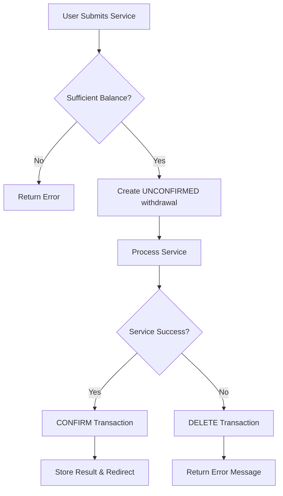

# Confirmation-Based Payment System

## Overview

The **Confirmation-Based Payment System** eliminates the poor UX of deduction-refund cycles in wallet transactions. Instead of immediately deducting money and then refunding on service failure, this system uses **Bavix wallet's unconfirmed transactions** to hold funds until service completion.

## Problem Solved

### Before (Bad UX):
```
1. User requests service
2. System deducts 1000 Toman from wallet ❌ (Transaction #1)
3. Service fails (wrong card number)
4. System refunds 1000 Toman to wallet ❌ (Transaction #2)
Result: User sees TWO transactions in their wallet history
```

### After (Good UX):
```
1. User requests service
2. System creates PENDING withdrawal (invisible to user) ⏳
3. Service fails (wrong card number)
4. System CANCELS pending transaction (deletes it) ✅
Result: User sees NO transactions in their wallet history
```

## Technical Implementation

### Core Components

1. **ConfirmationBasedPaymentService** - Main service handling confirmation logic
2. **Updated ServicePaymentService** - Now delegates to confirmation service
3. **Database migrations** - Added wallet_transaction_id fields
4. **Model updates** - Support for wallet transaction relationships

### Flow Diagram



### Key Features

#### 1. Unconfirmed Transactions
- Uses Bavix wallet's `confirmed` field
- `$user->withdraw($amount, $meta, false)` creates pending transaction
- Funds are held but not visible to user

#### 2. Confirmation on Success
```php
$transaction->update([
    'confirmed' => true,
    'meta' => [...] // Updated metadata
]);
```

#### 3. Cancellation on Failure
```php
$transaction->delete(); // Completely removes transaction
```

#### 4. Admin Controls
- Force confirm transactions
- Force cancel transactions
- View pending transactions

## Database Schema Changes

### service_requests table
```sql
ALTER TABLE service_requests ADD COLUMN wallet_transaction_id BIGINT UNSIGNED NULL;
ALTER TABLE service_requests ADD COLUMN error_message TEXT NULL;
ALTER TABLE service_requests ADD FOREIGN KEY (wallet_transaction_id) REFERENCES transactions(id);
```

### service_results table
```sql
ALTER TABLE service_results ADD COLUMN wallet_transaction_id BIGINT UNSIGNED NULL;
ALTER TABLE service_results ADD FOREIGN KEY (wallet_transaction_id) REFERENCES transactions(id);
```

## Usage Examples

### Basic Service Processing
```php
use App\Services\ConfirmationBasedPaymentService;

$confirmationService = app(ConfirmationBasedPaymentService::class);
$result = $confirmationService->processServiceWithConfirmation(
    $request, 
    $service, 
    $serviceData, 
    $user
);
```

### Check User Balance
```php
$canAfford = $confirmationService->canAffordService($user, $service);
$availableBalance = $confirmationService->getAvailableBalance($user);
```

### View Pending Transactions
```php
$pendingTransactions = $confirmationService->getPendingTransactions($user);
```

### Admin Functions
```php
// Force confirm a transaction
$confirmationService->forceConfirmTransaction($transactionId, 'Admin approval');

// Force cancel a transaction
$confirmationService->forceCancelTransaction($transactionId, 'Service unavailable');
```

## Benefits

### For Users
- ✅ **Clean transaction history** - No deduction-refund cycles
- ✅ **Better UX** - Failed services don't create wallet noise
- ✅ **Accurate balance** - Only confirmed transactions affect balance
- ✅ **Transparency** - Only see transactions for successful services

### For Admins
- ✅ **Better analytics** - Clean transaction data
- ✅ **Easier support** - No confusing refund transactions
- ✅ **Audit trail** - Failed transactions still logged (before deletion)
- ✅ **Manual control** - Force confirm/cancel capabilities

### For Developers
- ✅ **Cleaner code** - No refund logic needed
- ✅ **Atomic operations** - Service success/failure is binary
- ✅ **Better logging** - Clear transaction lifecycle
- ✅ **Extensible** - Easy to add new confirmation logic

## Transaction States

### 1. Pending (`confirmed = false`)
- Transaction created but not confirmed
- Funds are held but not deducted from available balance
- User doesn't see this in their transaction history
- Can be confirmed or cancelled

### 2. Confirmed (`confirmed = true`)
- Transaction completed successfully
- Funds deducted from available balance
- User sees this in their transaction history
- Cannot be reversed (use separate refund transaction)

### 3. Cancelled (deleted)
- Transaction removed completely
- Funds restored to available balance
- No trace in user's transaction history
- Logged for admin audit purposes

## Migration Guide

### For Existing Services

1. **Update service controllers** to use `ServicePaymentService` (already updated)
2. **No changes needed** - delegation happens automatically
3. **Test thoroughly** - Verify error handling works correctly

### For New Services

```php
// In your service controller
protected function handleServiceWithPayment(Request $request, Service $service, array $serviceData)
{
    $servicePaymentService = app(ServicePaymentService::class);
    return $servicePaymentService->handleServiceSubmission($request, $service, $serviceData);
}
```

## Monitoring and Analytics

### Key Metrics to Track

1. **Pending Transaction Rate** - How many transactions remain unconfirmed
2. **Service Success Rate** - Ratio of confirmed vs cancelled transactions
3. **Average Confirmation Time** - Time between creation and confirmation
4. **Manual Intervention Rate** - Admin force confirms/cancels

### Recommended Monitoring

```php
// Daily pending transactions cleanup (cronjob)
$oldPendingTransactions = Transaction::where('confirmed', false)
    ->where('created_at', '<', now()->subHours(24))
    ->get();

foreach ($oldPendingTransactions as $transaction) {
    // Log and potentially auto-cancel old pending transactions
}
```

## Error Handling

### Common Scenarios

1. **Insufficient Balance**
   - Returns error immediately
   - No transaction created

2. **Service API Failure**
   - Transaction cancelled automatically
   - User receives error message
   - No refund needed

3. **Database Transaction Failure**
   - Full rollback using DB::beginTransaction()
   - Consistent state maintained

4. **Partial Service Success**
   - Define clear success criteria
   - Either fully confirm or fully cancel
   - No partial confirmations

## Security Considerations

### Transaction Integrity
- All operations wrapped in database transactions
- Atomic success/failure guarantees
- Proper error handling and rollbacks

### Access Control
- Admin functions require proper permissions
- Audit logging for all manual interventions
- Rate limiting on transaction creation

### Data Consistency
- Foreign key constraints ensure referential integrity
- Cascading deletes handle orphaned records
- Index optimization for performance

## Performance Optimization

### Database Indexes
```sql
-- Already added in migrations
CREATE INDEX idx_wallet_transaction_id ON service_requests(wallet_transaction_id);
CREATE INDEX idx_wallet_transaction_id ON service_results(wallet_transaction_id);
CREATE INDEX idx_confirmed_transactions ON transactions(confirmed);
```

### Query Optimization
- Use eager loading for wallet transaction relationships
- Limit pending transaction queries with time bounds
- Cache user balance calculations

### Cleanup Jobs
```php
// Remove old cancelled transaction logs (optional)
php artisan schedule:run confirmation:cleanup-old-logs
```

## Testing Strategy

### Unit Tests
- Test confirmation logic with various scenarios
- Verify transaction state transitions
- Test error handling and rollbacks

### Integration Tests
- Test full service flows end-to-end
- Verify database consistency
- Test concurrent transaction handling

### User Acceptance Tests
- Verify clean wallet history
- Test all error scenarios
- Confirm admin dashboard functionality

## Future Enhancements

### Potential Improvements

1. **Partial Confirmations** - For services with multiple steps
2. **Scheduled Confirmations** - Delay confirmation for certain services
3. **Batch Operations** - Confirm/cancel multiple transactions
4. **Advanced Analytics** - Transaction flow visualization
5. **API Endpoints** - REST API for external integrations

### Backwards Compatibility

The system is designed to be backwards compatible:
- Existing confirmed transactions remain unchanged
- Old service flows continue to work
- Gradual migration possible service by service

---

## Summary

The Confirmation-Based Payment System provides a superior user experience by eliminating confusing deduction-refund cycles. By leveraging Bavix wallet's confirmation feature, we ensure users only see successful service transactions in their wallet history, while maintaining full audit trails and admin control capabilities.

**Key Benefits:**
- 🚀 **Better UX** - Clean transaction history
- 🛡️ **Atomic Operations** - No partial states
- 📊 **Better Analytics** - Clean data
- 🔧 **Admin Control** - Manual override capabilities
- 🔒 **Secure** - Full transaction integrity

This system scales with your application and provides a solid foundation for future payment system enhancements. 