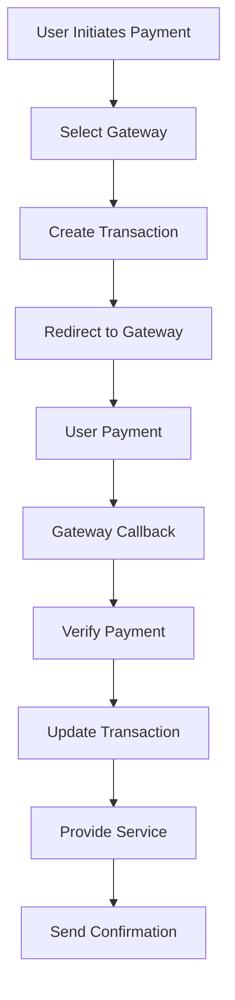

# Payment System Documentation

## Overview

The Pishkhanak platform integrates with multiple Iranian payment gateways to provide secure and reliable payment processing for financial services. The system supports multiple payment providers with automatic fallback mechanisms and comprehensive transaction tracking.

## Supported Payment Gateways

### 1. Jibit Gateway
- **Provider**: Jibit Payment Solutions
- **Services**: Card payments, wallet transfers, bill payments
- **Integration**: Full REST API integration
- **Features**: Real-time verification, refund support

### 2. Finnotech Gateway  
- **Provider**: Finnotech Financial Services
- **Services**: Banking inquiries, payment processing
- **Integration**: OAuth 2.0 + REST API
- **Features**: SMS verification, token management

### 3. Sepehr Gateway
- **Provider**: Sepehr Electronic Payment
- **Services**: Card-to-card transfers, account payments
- **Integration**: Direct API integration
- **Features**: Instant transfers, receipt generation

## Architecture

### Core Components

#### 1. PaymentService (`app/Services/PaymentService.php`)
Central payment orchestrator:
```php
class PaymentService
{
    public function processPayment(PaymentRequest $request): PaymentResult
    {
        $gateway = $this->selectGateway($request);
        return $gateway->process($request);
    }
    
    private function selectGateway(PaymentRequest $request): PaymentGatewayInterface
    {
        // Gateway selection logic based on amount, type, availability
    }
}
```

#### 2. ServicePaymentService (`app/Services/ServicePaymentService.php`)
Service-specific payment handling:
```php
class ServicePaymentService
{
    public function createServicePayment(Service $service, User $user): PaymentTransaction
    {
        return GatewayTransaction::create([
            'user_id' => $user->id,
            'service_id' => $service->id,
            'amount' => $service->price,
            'currency' => 'IRR',
            'status' => 'pending'
        ]);
    }
}
```

#### 3. GuestServiceClaimService (`app/Services/GuestServiceClaimService.php`)
Anonymous payment processing:
```php
class GuestServiceClaimService
{
    public function processGuestPayment(string $mobile, Service $service): PaymentResult
    {
        // Handle payments without user registration
        // SMS verification for mobile number
        // Temporary session-based tracking
    }
}
```

## Payment Gateway Implementations

### Jibit Integration

#### Service Structure
```
app/Services/Jibit/
├── JibitService.php          # Main service class
├── Token.php                 # Token management
├── CardIban.php              # Card-IBAN services
├── Identity.php              # Identity verification
├── Finance.php               # Financial services
├── Bill.php                  # Bill payment
├── MobileCharge.php          # Mobile top-up
└── SMS.php                   # SMS services
```

#### Implementation Example
```php
class JibitService extends BasePaymentService
{
    protected string $baseUrl = 'https://api.jibit.ir';
    
    public function createPayment(PaymentRequest $request): PaymentResponse
    {
        $token = $this->getAccessToken();
        
        $response = $this->client->post('/payments', [
            'headers' => [
                'Authorization' => "Bearer {$token}",
                'Content-Type' => 'application/json'
            ],
            'json' => [
                'amount' => $request->amount,
                'callback_url' => route('payment.callback.jibit'),
                'description' => $request->description,
                'mobile' => $request->mobile
            ]
        ]);
        
        return new PaymentResponse($response->json());
    }
}
```

### Finnotech Integration

#### Service Structure
```
app/Services/Finnotech/
├── FinnotechService.php      # Core service
├── SmsAuthorizationService.php # SMS auth
├── OakSmsService.php         # OAK SMS provider
├── KycSmsService.php         # KYC verification
├── CreditSmsService.php      # Credit services
├── CardIban.php              # Card services
├── Facility.php              # Facility inquiries
├── Inquiry.php               # General inquiries
├── Vehicle.php               # Vehicle services
├── Promissory.php            # Promissory notes
└── KYC.php                   # Know Your Customer
```

#### OAuth Implementation
```php
class FinnotechService
{
    public function authenticate(): string
    {
        $response = $this->client->post('/oauth/token', [
            'grant_type' => 'client_credentials',
            'client_id' => config('finnotech.client_id'),
            'client_secret' => config('finnotech.client_secret'),
            'scope' => 'oak:facility-inquiry:get'
        ]);
        
        return $response['access_token'];
    }
    
    public function refreshToken(string $refreshToken): string
    {
        // Token refresh logic
    }
}
```

## Database Schema

### Core Tables

#### 1. payment_gateways
```sql
CREATE TABLE payment_gateways (
    id BIGINT PRIMARY KEY,
    name VARCHAR(255) NOT NULL,
    slug VARCHAR(100) UNIQUE NOT NULL,
    config JSON NOT NULL,
    is_active BOOLEAN DEFAULT true,
    priority INTEGER DEFAULT 1,
    min_amount DECIMAL(15,2) DEFAULT 0,
    max_amount DECIMAL(15,2),
    supported_currencies JSON,
    fees JSON,
    created_at TIMESTAMP,
    updated_at TIMESTAMP
);
```

#### 2. gateway_transactions
```sql
CREATE TABLE gateway_transactions (
    id BIGINT PRIMARY KEY,
    user_id BIGINT,
    service_id BIGINT,
    gateway_id BIGINT NOT NULL,
    gateway_transaction_id VARCHAR(255),
    amount DECIMAL(15,2) NOT NULL,
    currency VARCHAR(3) DEFAULT 'IRR',
    status ENUM('pending', 'processing', 'completed', 'failed', 'cancelled'),
    payment_method VARCHAR(50),
    metadata JSON,
    fees DECIMAL(15,2) DEFAULT 0,
    net_amount DECIMAL(15,2),
    callback_url TEXT,
    redirect_url TEXT,
    expires_at TIMESTAMP,
    completed_at TIMESTAMP,
    created_at TIMESTAMP,
    updated_at TIMESTAMP,
    
    INDEX idx_user_id (user_id),
    INDEX idx_gateway_id (gateway_id),
    INDEX idx_status (status),
    INDEX idx_gateway_transaction_id (gateway_transaction_id)
);
```

#### 3. gateway_transaction_logs
```sql
CREATE TABLE gateway_transaction_logs (
    id BIGINT PRIMARY KEY,
    transaction_id BIGINT NOT NULL,
    event_type VARCHAR(50) NOT NULL,
    request_data JSON,
    response_data JSON,
    http_status INTEGER,
    error_message TEXT,
    created_at TIMESTAMP,
    
    INDEX idx_transaction_id (transaction_id),
    INDEX idx_event_type (event_type)
);
```

## Payment Flow

### Standard Payment Process



### Implementation Steps

#### 1. Payment Initiation
```php
Route::post('/services/{service}/pay', function (Service $service, Request $request) {
    $paymentService = new ServicePaymentService();
    
    // Create transaction record
    $transaction = $paymentService->createServicePayment($service, $request->user());
    
    // Select appropriate gateway
    $gateway = $paymentService->selectOptimalGateway($service->price);
    
    // Create payment with gateway
    $paymentUrl = $gateway->createPayment($transaction);
    
    return redirect($paymentUrl);
});
```

#### 2. Gateway Callback Handling
```php
Route::post('/payment/callback/{gateway}', function (string $gateway, Request $request) {
    $handler = PaymentCallbackFactory::create($gateway);
    $result = $handler->handle($request);
    
    if ($result->isSuccessful()) {
        // Update transaction status
        // Activate service for user
        // Send confirmation SMS/email
        return redirect()->route('payment.success');
    }
    
    return redirect()->route('payment.failed');
});
```

## Gateway Configuration

### Environment Variables
```env
# Jibit Configuration
JIBIT_CLIENT_ID=your_jibit_client_id
JIBIT_CLIENT_SECRET=your_jibit_client_secret
JIBIT_BASE_URL=https://api.jibit.ir
JIBIT_CALLBACK_URL=https://pishkhanak.com/payment/callback/jibit

# Finnotech Configuration
FINNOTECH_CLIENT_ID=your_finnotech_client_id
FINNOTECH_CLIENT_SECRET=your_finnotech_client_secret
FINNOTECH_BASE_URL=https://api.finnotech.ir
FINNOTECH_SCOPE=oak:facility-inquiry:get

# Sepehr Configuration  
SEPEHR_MERCHANT_ID=your_sepehr_merchant_id
SEPEHR_SECRET_KEY=your_sepehr_secret_key
SEPEHR_BASE_URL=https://api.sepehrpay.com
```

### Database Configuration
```php
// Seeder: PaymentGatewaySeeder
PaymentGateway::create([
    'name' => 'Jibit',
    'slug' => 'jibit',
    'config' => [
        'client_id' => env('JIBIT_CLIENT_ID'),
        'client_secret' => env('JIBIT_CLIENT_SECRET'),
        'base_url' => env('JIBIT_BASE_URL'),
        'timeout' => 30
    ],
    'is_active' => true,
    'priority' => 1,
    'min_amount' => 1000,
    'max_amount' => 50000000,
    'fees' => [
        'fixed' => 0,
        'percentage' => 0.015
    ]
]);
```

## Transaction Management

### Transaction States
```php
enum TransactionStatus: string
{
    case PENDING = 'pending';
    case PROCESSING = 'processing';
    case COMPLETED = 'completed';
    case FAILED = 'failed';
    case CANCELLED = 'cancelled';
    case REFUNDED = 'refunded';
}
```

### Status Updates
```php
class GatewayTransaction extends Model
{
    public function markAsCompleted(array $gatewayData = []): void
    {
        $this->update([
            'status' => TransactionStatus::COMPLETED,
            'completed_at' => now(),
            'metadata' => array_merge($this->metadata ?? [], $gatewayData)
        ]);
        
        // Trigger service activation
        event(new PaymentCompleted($this));
    }
    
    public function markAsFailed(string $reason): void
    {
        $this->update([
            'status' => TransactionStatus::FAILED,
            'metadata' => array_merge($this->metadata ?? [], [
                'failure_reason' => $reason,
                'failed_at' => now()
            ])
        ]);
        
        event(new PaymentFailed($this));
    }
}
```

## Error Handling and Retries

### Retry Logic
```php
class PaymentRetryService
{
    public function retryFailedPayment(GatewayTransaction $transaction): PaymentResult
    {
        if ($transaction->retry_count >= 3) {
            throw new MaxRetriesExceededException();
        }
        
        try {
            $gateway = GatewayFactory::create($transaction->gateway->slug);
            $result = $gateway->processPayment($transaction);
            
            $transaction->increment('retry_count');
            
            return $result;
        } catch (Exception $e) {
            $this->logError($transaction, $e);
            throw $e;
        }
    }
}
```

### Fallback Gateway Selection
```php
class GatewaySelectionService
{
    public function selectGateway(PaymentRequest $request): PaymentGateway
    {
        $gateways = PaymentGateway::active()
            ->where('min_amount', '<=', $request->amount)
            ->where('max_amount', '>=', $request->amount)
            ->orderBy('priority')
            ->get();
            
        foreach ($gateways as $gateway) {
            if ($this->isGatewayHealthy($gateway)) {
                return $gateway;
            }
        }
        
        throw new NoAvailableGatewayException();
    }
    
    private function isGatewayHealthy(PaymentGateway $gateway): bool
    {
        // Check gateway health via cache or health endpoint
        return Cache::remember(
            "gateway_health_{$gateway->id}",
            300, // 5 minutes
            fn() => $this->checkGatewayHealth($gateway)
        );
    }
}
```

## Webhook Security

### Signature Verification
```php
class VerifyWebhookSignature
{
    public function handle(Request $request, Closure $next)
    {
        $gateway = $this->identifyGateway($request);
        $expectedSignature = $this->calculateExpectedSignature($request, $gateway);
        
        if (!hash_equals($expectedSignature, $request->header('X-Signature'))) {
            throw new InvalidSignatureException();
        }
        
        return $next($request);
    }
    
    private function calculateExpectedSignature(Request $request, PaymentGateway $gateway): string
    {
        $payload = $request->getContent();
        $secret = $gateway->config['webhook_secret'];
        
        return hash_hmac('sha256', $payload, $secret);
    }
}
```

## Monitoring and Analytics

### Payment Metrics
```php
class PaymentAnalyticsService
{
    public function getMetrics(Carbon $from, Carbon $to): array
    {
        return [
            'total_transactions' => GatewayTransaction::whereBetween('created_at', [$from, $to])->count(),
            'total_amount' => GatewayTransaction::completed()->whereBetween('created_at', [$from, $to])->sum('amount'),
            'success_rate' => $this->calculateSuccessRate($from, $to),
            'average_amount' => $this->calculateAverageAmount($from, $to),
            'gateway_breakdown' => $this->getGatewayBreakdown($from, $to),
            'failure_reasons' => $this->getFailureReasons($from, $to)
        ];
    }
}
```

### Dashboard Integration
```php
// Filament Widget
class PaymentStatsWidget extends BaseWidget
{
    protected static string $view = 'filament.widgets.payment-stats';
    
    protected function getCards(): array
    {
        $analytics = new PaymentAnalyticsService();
        $metrics = $analytics->getMetrics(now()->subDays(30), now());
        
        return [
            Stat::make('Total Transactions', $metrics['total_transactions']),
            Stat::make('Total Amount', number_format($metrics['total_amount']) . ' تومان'),
            Stat::make('Success Rate', $metrics['success_rate'] . '%'),
        ];
    }
}
```

## Testing

### Unit Tests
```php
class PaymentServiceTest extends TestCase
{
    public function test_successful_payment_processing()
    {
        $service = Service::factory()->create(['price' => 10000]);
        $user = User::factory()->create();
        
        $paymentService = new ServicePaymentService();
        $transaction = $paymentService->createServicePayment($service, $user);
        
        $this->assertEquals('pending', $transaction->status);
        $this->assertEquals(10000, $transaction->amount);
    }
    
    public function test_gateway_fallback()
    {
        // Mock primary gateway failure
        // Verify fallback gateway is used
        // Assert payment still processes successfully
    }
}
```

### Integration Tests
```php
class JibitIntegrationTest extends TestCase
{
    public function test_jibit_payment_flow()
    {
        $gateway = new JibitService();
        
        $paymentRequest = new PaymentRequest([
            'amount' => 50000,
            'description' => 'Test payment',
            'mobile' => '09123456789'
        ]);
        
        $response = $gateway->createPayment($paymentRequest);
        
        $this->assertNotNull($response->payment_url);
        $this->assertNotNull($response->transaction_id);
    }
}
```

## Security Best Practices

### 1. PCI Compliance
- No card data storage
- Secure transmission (HTTPS only)
- Gateway tokenization
- Regular security audits

### 2. Data Protection
```php
// Encrypt sensitive transaction data
class GatewayTransaction extends Model
{
    protected $casts = [
        'metadata' => 'encrypted:array'
    ];
}
```

### 3. Rate Limiting
```php
// Prevent payment abuse
RateLimiter::for('payment-creation', function (Request $request) {
    return Limit::perMinute(5)->by($request->user()?->id ?: $request->ip());
});
```

## Troubleshooting

### Common Issues

1. **Gateway Timeouts**
   - Increase timeout configuration
   - Implement retry mechanism
   - Use circuit breaker pattern

2. **Callback Failures**
   - Verify webhook URLs
   - Check signature validation
   - Monitor callback logs

3. **Amount Mismatches**
   - Validate amount formatting
   - Check currency conversion
   - Verify gateway fee calculation

### Debug Commands
```bash
# Test gateway connectivity
php artisan payment:test-gateway jibit

# Retry failed transactions
php artisan payment:retry-failed

# Generate payment report
php artisan payment:generate-report --from=2024-01-01 --to=2024-12-31

# Clear payment cache
php artisan cache:tags payment --flush
```

## Future Enhancements

### Planned Features
1. **Cryptocurrency Support**: Bitcoin and Ethereum payments
2. **Installment Payments**: Split payment functionality
3. **Subscription Billing**: Recurring payment support
4. **International Gateways**: PayPal, Stripe integration
5. **Payment Links**: Shareable payment URLs
6. **QR Code Payments**: Mobile-friendly payment method