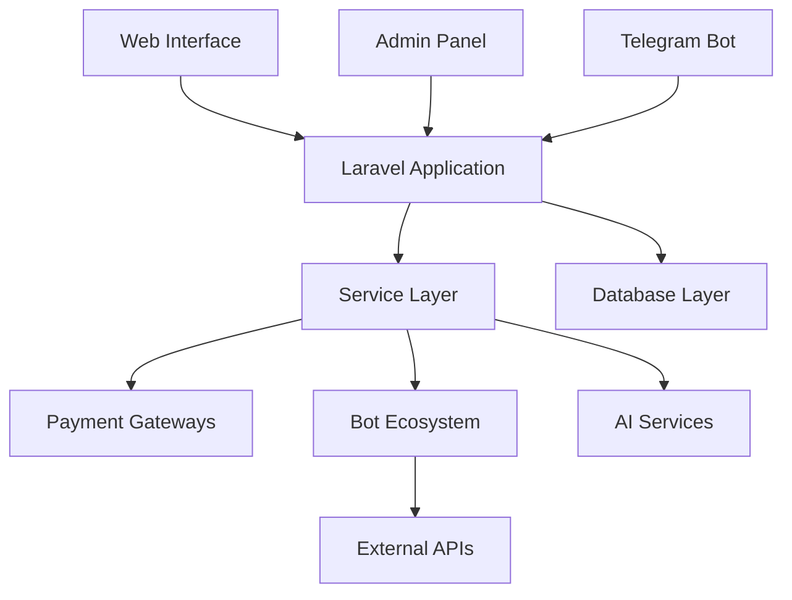

# 🏦 Pishkhanak Financial Services Platform

> **Comprehensive Laravel-based financial inquiry platform serving Iranian banking and credit systems**

## 📋 Quick Navigation

### 📖 **Documentation Hub**
- **[🏗️ Architecture Overview](ARCHITECTURE.md)** - System design, components, and data flow
- **[🔌 API Reference](API_REFERENCE.md)** - Endpoints, services, and integration patterns  
- **[👩‍💻 Development Guide](DEVELOPMENT.md)** - Setup, workflows, and contribution guidelines

### 🚀 **Getting Started**
1. **[Architecture Overview](ARCHITECTURE.md#core-architecture)** - Understand the system design
2. **[Development Setup](DEVELOPMENT.md#environment-setup)** - Configure your development environment
3. **[API Integration](API_REFERENCE.md#authentication)** - Connect to platform services

---

## 🎯 **Platform Overview**

### **Core Purpose**
Multi-service financial platform providing:
- **Bank account inquiries** via automated web scraping
- **Credit score assessments** through multiple data providers  
- **Payment processing** with Iranian gateway integration
- **AI-powered content generation** for services and documentation
- **Multi-channel support** (Web, Telegram, Admin panel)

### **Technology Stack**
```
🏗️ Backend:    Laravel 11 + PostgreSQL + Redis
🎨 Frontend:    Livewire + Blade + TailwindCSS  
👑 Admin:       Filament 3.x with Persian localization
🤖 Bots:        Node.js (inquiry-provider) + Python (ML)
💳 Payments:    Jibit, SEP, Saman gateways
🧠 AI:          OpenAI GPT + Google Gemini + Midjourney
📱 Messaging:   Telegram Bot API + SMS (Finnotech)
```

### **Business Model**
- **Service-based pricing** with wallet system
- **Multi-provider redundancy** for high availability
- **Automated processing** reducing manual overhead
- **Scalable architecture** supporting growth

---

## 🏗️ **System Architecture**

### **Application Layers**


### **Core Components**

#### **🔧 Laravel Application** (`app/`)
- **46+ Models** - Business entities and relationships
- **25+ Services** - Business logic and integrations  
- **Controllers** - Web, API, and webhook endpoints
- **Middleware** - Security, validation, rate limiting
- **Jobs & Events** - Background processing system

#### **🤖 Bot Ecosystem** (`bots/`)
- **[inquiry-provider](ARCHITECTURE.md#inquiry-provider)** - Node.js web scraping service
- **[captcha-solver](ARCHITECTURE.md#captcha-solver)** - Python ML-based CAPTCHA recognition

#### **👑 Admin Interface** (Filament)
- **User Management** - Accounts, roles, permissions
- **Service Configuration** - Pricing, providers, settings
- **Financial Monitoring** - Transactions, wallets, analytics
- **Content Management** - AI-generated content oversight

---

## 📊 **Key Metrics & Features**

### **Service Coverage**
- **67 Services** updated from 12,500 → 20,000 IRT pricing
- **Multiple Banks** supported (Melli, Mellat, Parsian, Tejarat, etc.)
- **Redundant Providers** (NICS24, Rade) for reliability
- **Real-time Processing** with queue-based architecture

### **Technical Highlights**
- **Multi-language Support** - Persian/Farsi UI with Verta calendar
- **Security Features** - OTP authentication, CSRF protection, rate limiting
- **Performance** - Redis caching, queue processing, optimized queries
- **Monitoring** - Comprehensive logging, error tracking, health checks

### **Integration Points**
- **Payment Gateways** - Jibit, SEP, Saman with unified interface
- **SMS Provider** - Finnotech for OTP and notifications
- **AI Services** - OpenAI, Gemini for content generation
- **External APIs** - Banking APIs, credit bureaus, government services

---

## 🔍 **Quick Reference**

### **Important File Locations**
```
📁 Core Application
├── app/Models/Service.php:311     # Main service model
├── app/Services/                  # Business logic layer
├── routes/web.php:19              # Web routes definition
└── resources/views/front/         # User interface templates

📁 Bot Services  
├── bots/inquiry-provider/         # Node.js scraping service
├── bots/persian-digits-captcha-solver/  # Python ML service
└── PM2 ecosystem configuration

📁 Configuration
├── .env                          # Environment variables
├── config/services.php           # External service configuration  
└── database/migrations/          # Database schema evolution
```

### **Key Commands**
```bash
# Application Management
php artisan queue:work            # Start background processing
php artisan serve                 # Development server
php artisan migrate               # Database updates

# Bot Management  
pm2 start ecosystem.config.js     # Start all bot services
pm2 logs localApiServer           # View bot logs
pm2 restart inquiry-provider      # Restart specific service

# Development Tools
php artisan tinker                # Laravel REPL
npm run dev                       # Asset compilation
```

### **Environment Health Check**
```bash
# System Status
pm2 status                        # Bot services status
php artisan queue:work --timeout=60  # Queue processing health
redis-cli ping                    # Cache system health
```

---

## 🚨 **Support & Maintenance**

### **Issue Resolution Priority**
1. **🔴 Critical** - Payment processing, user authentication
2. **🟡 High** - Service availability, data accuracy  
3. **🟢 Medium** - UI improvements, performance optimization
4. **🔵 Low** - Feature requests, documentation updates

### **Contact Points**
- **Technical Issues** - Check logs in `storage/logs/`
- **Bot Problems** - PM2 logs and `bots/` directory diagnostics
- **Payment Issues** - Gateway-specific error handling in services
- **Performance** - Redis cache and queue monitoring

### **Documentation Maintenance**
This documentation is maintained alongside code changes. Key update triggers:
- New service additions
- Architecture modifications  
- External API changes
- Security updates

---

*📅 Last Updated: 2025-09-08 | 📖 Version: 1.0 | 🔄 Auto-generated via SuperClaude /sc:index*