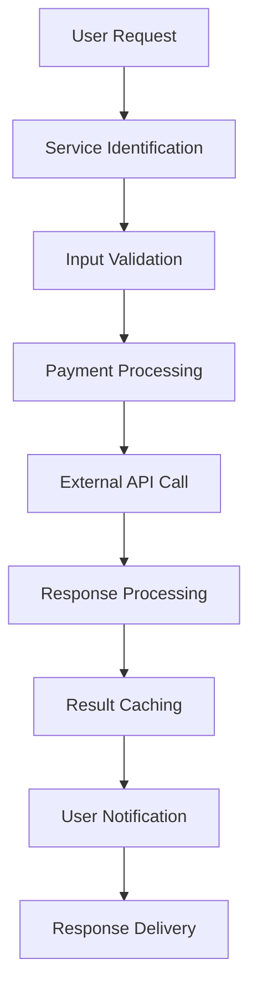
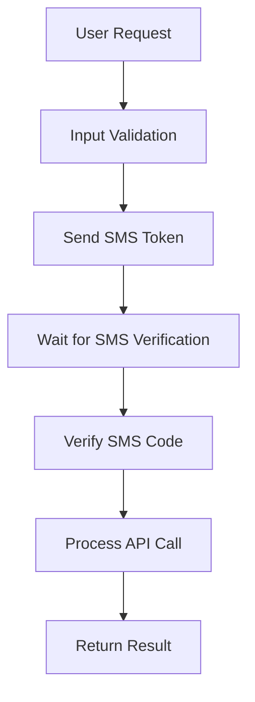

# Service Architecture Documentation

## Overview

The Pishkhanak platform provides a comprehensive range of Iranian financial, governmental, and administrative inquiry services through a scalable microservice-like architecture. The system supports over 50+ different service types with standardized processing, caching, and result delivery mechanisms.

## Service Categories

### 1. Financial Services
- **IBAN Services**: Account-IBAN mapping, IBAN validation
- **Card Services**: Card-to-account inquiry, card information
- **Credit Services**: Credit score inquiry, facility information
- **Banking**: Account details, transaction history, cheque status

### 2. Vehicle Services  
- **Traffic Violations**: Violation inquiry, fine details, payment
- **Vehicle Information**: Registration details, technical inspection
- **Insurance**: Third-party insurance history, insurance discounts
- **Ownership**: Owner verification, transfer history

### 3. Identity Services
- **National ID**: Validation, life status verification
- **Documents**: Passport tracking, military service status
- **Government**: Social security records, tax information
- **Postal**: Postal code validation, address verification

## Architecture Patterns

### 1. Service Controller Pattern

All services follow a standardized controller architecture using the Factory pattern:

```php
// ServiceControllerFactory.php
class ServiceControllerFactory
{
    private static array $controllers = [
        'iban-check' => IbanCheckController::class,
        'card-account' => CardAccountController::class,
        'credit-score' => CreditScoreInquiryController::class,
        'vehicle-info' => VehicleInfoInquiryController::class,
        // ... 50+ more services
    ];
    
    public static function create(string $serviceSlug, Request $request): BaseServiceController
    {
        $controllerClass = self::$controllers[$serviceSlug] ?? null;
        
        if (!$controllerClass) {
            throw new ServiceNotFoundException("Service {$serviceSlug} not found");
        }
        
        return new $controllerClass($request);
    }
}
```

### 2. Base Service Controller

All service controllers extend from a base class that provides standardized functionality:

```php
abstract class BaseServiceController
{
    protected Service $service;
    protected PaymentService $paymentService;
    protected SmsVerificationService $smsService;
    
    abstract protected function validateInput(Request $request): array;
    abstract protected function callExternalApi(array $data): array;
    abstract protected function formatResponse(array $apiResponse): array;
    
    public function process(Request $request): ServiceResponse
    {
        // Standard processing flow for all services
        $validatedData = $this->validateInput($request);
        $paymentResult = $this->processPayment($request, $validatedData);
        
        if (!$paymentResult->isSuccessful()) {
            return new ServiceResponse(false, 'Payment failed');
        }
        
        $apiResponse = $this->callExternalApiWithRetry($validatedData);
        $formattedResponse = $this->formatResponse($apiResponse);
        
        $this->cacheResult($formattedResponse);
        $this->notifyUser($request->user(), $formattedResponse);
        
        return new ServiceResponse(true, 'Success', $formattedResponse);
    }
}
```

### 3. Service Provider Integration

#### Finnotech Services
```php
abstract class BaseFinnotechController extends BaseServiceController
{
    protected FinnotechService $finnotechService;
    
    protected function callExternalApi(array $data): array
    {
        $token = $this->finnotechService->getAccessToken();
        
        return $this->finnotechService->makeRequest($this->getApiEndpoint(), [
            'headers' => ['Authorization' => "Bearer {$token}"],
            'json' => $this->prepareRequestData($data)
        ]);
    }
    
    abstract protected function getApiEndpoint(): string;
    abstract protected function prepareRequestData(array $data): array;
}
```

#### SMS-Based Services
```php
abstract class BaseSmsFinnotechController extends BaseFinnotechController
{
    protected function processWithSmsVerification(array $data): array
    {
        // Send SMS for verification
        $smsResult = $this->finnotechService->sendSmsToken([
            'nationalCode' => $data['national_code'],
            'mobile' => $data['mobile']
        ]);
        
        if (!$smsResult['success']) {
            throw new SmsVerificationException('SMS sending failed');
        }
        
        return [
            'verification_id' => $smsResult['verification_id'],
            'message' => 'SMS sent for verification',
            'expires_at' => now()->addMinutes(5)
        ];
    }
    
    protected function verifyAndProcess(string $verificationId, string $code, array $originalData): array
    {
        $verificationResult = $this->finnotechService->verifySmsToken($verificationId, $code);
        
        if (!$verificationResult['success']) {
            throw new InvalidSmsCodeException();
        }
        
        return $this->callExternalApi($originalData);
    }
}
```

## Service Implementation Examples

### 1. IBAN Check Service
```php
class IbanCheckController extends BaseFinnotechController
{
    protected function validateInput(Request $request): array
    {
        return $request->validate([
            'iban' => ['required', 'string', 'size:24', 'regex:/^IR\d{22}$/']
        ]);
    }
    
    protected function getApiEndpoint(): string
    {
        return '/oak/v2/clients/ibanInquiry';
    }
    
    protected function prepareRequestData(array $data): array
    {
        return [
            'iban' => $data['iban']
        ];
    }
    
    protected function formatResponse(array $apiResponse): array
    {
        return [
            'iban' => $apiResponse['iban'],
            'bank_name' => $apiResponse['bankName'],
            'account_holder' => $apiResponse['accountHolder'],
            'is_valid' => $apiResponse['isValid'],
            'inquiry_date' => now()->format('Y-m-d H:i:s')
        ];
    }
}
```

### 2. Credit Score Inquiry
```php
class CreditScoreInquiryController extends BaseSmsFinnotechController
{
    protected function validateInput(Request $request): array
    {
        return $request->validate([
            'national_code' => ['required', 'string', 'size:10', 'regex:/^\d{10}$/'],
            'mobile' => ['required', 'string', 'size:11', 'regex:/^09\d{9}$/'],
            'birth_date' => ['required', 'date_format:Y-m-d']
        ]);
    }
    
    protected function getApiEndpoint(): string
    {
        return '/oak/v2/clients/creditInquiry';
    }
    
    protected function formatResponse(array $apiResponse): array
    {
        return [
            'credit_score' => $apiResponse['creditScore'],
            'rating' => $this->calculateRating($apiResponse['creditScore']),
            'factors' => $apiResponse['factors'] ?? [],
            'last_update' => $apiResponse['lastUpdate'],
            'report_id' => $apiResponse['reportId']
        ];
    }
    
    private function calculateRating(int $score): string
    {
        return match(true) {
            $score >= 800 => 'Excellent',
            $score >= 700 => 'Very Good',
            $score >= 600 => 'Good',
            $score >= 500 => 'Fair',
            default => 'Poor'
        };
    }
}
```

### 3. Vehicle Information Service
```php
class VehicleInfoInquiryController extends BaseFinnotechController
{
    protected function validateInput(Request $request): array
    {
        return $request->validate([
            'plate_number' => ['required', 'string', 'regex:/^\d{2}[A-Z]\d{3}-\d{2}$/'],
            'national_code' => ['required', 'string', 'size:10']
        ]);
    }
    
    protected function getApiEndpoint(): string
    {
        return '/oak/v2/clients/vehicleInfo';
    }
    
    protected function formatResponse(array $apiResponse): array
    {
        return [
            'vehicle_info' => [
                'make' => $apiResponse['make'],
                'model' => $apiResponse['model'],
                'year' => $apiResponse['year'],
                'color' => $apiResponse['color'],
                'engine_number' => $apiResponse['engineNumber']
            ],
            'ownership_info' => [
                'owner_name' => $apiResponse['ownerName'],
                'registration_date' => $apiResponse['registrationDate']
            ],
            'technical_info' => [
                'vin' => $apiResponse['vin'],
                'fuel_type' => $apiResponse['fuelType'],
                'cylinders' => $apiResponse['cylinders']
            ]
        ];
    }
}
```

## Database Schema

### Core Tables

#### services
```sql
CREATE TABLE services (
    id BIGINT PRIMARY KEY,
    name VARCHAR(255) NOT NULL,
    slug VARCHAR(100) UNIQUE NOT NULL,
    category_id BIGINT NOT NULL,
    description TEXT,
    price DECIMAL(10,2) NOT NULL,
    provider VARCHAR(50) NOT NULL,
    endpoint VARCHAR(255),
    is_active BOOLEAN DEFAULT true,
    requires_sms BOOLEAN DEFAULT false,
    processing_time_seconds INTEGER DEFAULT 30,
    cache_duration_minutes INTEGER DEFAULT 1440,
    metadata JSON,
    created_at TIMESTAMP,
    updated_at TIMESTAMP,
    
    INDEX idx_category_id (category_id),
    INDEX idx_provider (provider),
    INDEX idx_is_active (is_active)
);
```

#### service_requests
```sql
CREATE TABLE service_requests (
    id BIGINT PRIMARY KEY,
    hash CHAR(16) UNIQUE NOT NULL,
    user_id BIGINT,
    service_id BIGINT NOT NULL,
    input_data JSON NOT NULL,
    status ENUM('pending', 'processing', 'completed', 'failed') DEFAULT 'pending',
    payment_status ENUM('pending', 'paid', 'failed') DEFAULT 'pending',
    payment_transaction_id BIGINT,
    processing_started_at TIMESTAMP,
    processing_completed_at TIMESTAMP,
    expires_at TIMESTAMP,
    created_at TIMESTAMP,
    updated_at TIMESTAMP,
    
    INDEX idx_user_id (user_id),
    INDEX idx_service_id (service_id),
    INDEX idx_hash (hash),
    INDEX idx_status (status),
    INDEX idx_expires_at (expires_at)
);
```

#### service_results  
```sql
CREATE TABLE service_results (
    id BIGINT PRIMARY KEY,
    request_id BIGINT NOT NULL,
    result_data JSON,
    formatted_data JSON,
    api_response JSON,
    processing_time_ms INTEGER,
    cached BOOLEAN DEFAULT false,
    cache_expires_at TIMESTAMP,
    created_at TIMESTAMP,
    
    INDEX idx_request_id (request_id),
    INDEX idx_cache_expires_at (cache_expires_at)
);
```

## Request Processing Flow

### Standard Flow


### SMS Verification Flow


## Caching Strategy

### Result Caching
```php
class ServiceCacheManager
{
    public function getCachedResult(string $serviceSlug, array $inputData): ?array
    {
        $cacheKey = $this->generateCacheKey($serviceSlug, $inputData);
        
        return Cache::tags(['service-results', $serviceSlug])
            ->get($cacheKey);
    }
    
    public function cacheResult(string $serviceSlug, array $inputData, array $result, int $ttl): void
    {
        $cacheKey = $this->generateCacheKey($serviceSlug, $inputData);
        
        Cache::tags(['service-results', $serviceSlug])
            ->put($cacheKey, $result, $ttl);
    }
    
    private function generateCacheKey(string $serviceSlug, array $inputData): string
    {
        return "service:{$serviceSlug}:" . md5(serialize($inputData));
    }
}
```

### Cache Invalidation
```php
class ServiceCacheInvalidator
{
    public function invalidateService(string $serviceSlug): void
    {
        Cache::tags(['service-results', $serviceSlug])->flush();
    }
    
    public function invalidateExpiredResults(): void
    {
        ServiceResult::whereNotNull('cache_expires_at')
            ->where('cache_expires_at', '<', now())
            ->update(['cached' => false]);
            
        Cache::tags(['service-results'])->flush();
    }
}
```

## Background Processing

### Queue Jobs

#### ServiceProcessingJob
```php
class ServiceProcessingJob implements ShouldQueue
{
    use Dispatchable, InteractsWithQueue, Queueable, SerializesModels;
    
    public function __construct(
        private ServiceRequest $request,
        private array $validatedData
    ) {}
    
    public function handle(): void
    {
        try {
            $this->request->update(['status' => 'processing', 'processing_started_at' => now()]);
            
            $controller = ServiceControllerFactory::create($this->request->service->slug);
            $result = $controller->callExternalApi($this->validatedData);
            
            ServiceResult::create([
                'request_id' => $this->request->id,
                'result_data' => $result,
                'formatted_data' => $controller->formatResponse($result),
                'processing_time_ms' => $this->getProcessingTime()
            ]);
            
            $this->request->update([
                'status' => 'completed',
                'processing_completed_at' => now()
            ]);
            
            // Send notification
            event(new ServiceProcessingCompleted($this->request));
            
        } catch (Exception $e) {
            $this->request->update(['status' => 'failed']);
            $this->fail($e);
        }
    }
}
```

### Scheduled Tasks
```php
// Console/Kernel.php
protected function schedule(Schedule $schedule): void
{
    // Clean expired service requests
    $schedule->command('services:cleanup-expired')
        ->hourly()
        ->description('Clean up expired service requests');
    
    // Refresh API tokens
    $schedule->command('tokens:refresh')
        ->everyThirtyMinutes()
        ->description('Refresh external API tokens');
    
    // Generate service analytics
    $schedule->command('services:generate-analytics')
        ->daily()
        ->description('Generate daily service usage analytics');
}
```

## Error Handling

### Retry Mechanism
```php
class ServiceApiRetryHandler
{
    private const MAX_RETRIES = 3;
    private const RETRY_DELAY = 1000; // milliseconds
    
    public function executeWithRetry(callable $apiCall): array
    {
        $lastException = null;
        
        for ($attempt = 1; $attempt <= self::MAX_RETRIES; $attempt++) {
            try {
                return $apiCall();
            } catch (ApiException $e) {
                $lastException = $e;
                
                if ($attempt < self::MAX_RETRIES) {
                    usleep(self::RETRY_DELAY * $attempt * 1000); // Exponential backoff
                    continue;
                }
            }
        }
        
        throw new MaxRetriesExceededException("Failed after " . self::MAX_RETRIES . " attempts", 0, $lastException);
    }
}
```

### Circuit Breaker Pattern
```php
class ServiceCircuitBreaker
{
    private const FAILURE_THRESHOLD = 5;
    private const RECOVERY_TIMEOUT = 300; // 5 minutes
    
    public function call(string $serviceProvider, callable $operation): mixed
    {
        $circuitKey = "circuit_breaker:{$serviceProvider}";
        $failures = Cache::get("{$circuitKey}:failures", 0);
        $lastFailure = Cache::get("{$circuitKey}:last_failure");
        
        // Check if circuit is open
        if ($failures >= self::FAILURE_THRESHOLD) {
            if ($lastFailure && now()->diffInSeconds($lastFailure) < self::RECOVERY_TIMEOUT) {
                throw new CircuitBreakerOpenException("Circuit breaker is open for {$serviceProvider}");
            }
            
            // Try to close circuit
            Cache::forget("{$circuitKey}:failures");
            Cache::forget("{$circuitKey}:last_failure");
        }
        
        try {
            $result = $operation();
            // Reset failure count on success
            Cache::forget("{$circuitKey}:failures");
            return $result;
        } catch (Exception $e) {
            // Increment failure count
            Cache::put("{$circuitKey}:failures", $failures + 1, 3600);
            Cache::put("{$circuitKey}:last_failure", now(), 3600);
            throw $e;
        }
    }
}
```

## Service Monitoring

### Health Checks
```php
class ServiceHealthMonitor
{
    public function checkServiceHealth(Service $service): ServiceHealthStatus
    {
        $metrics = [
            'availability' => $this->checkServiceAvailability($service),
            'response_time' => $this->measureResponseTime($service),
            'error_rate' => $this->calculateErrorRate($service),
            'success_rate' => $this->calculateSuccessRate($service)
        ];
        
        return new ServiceHealthStatus($service, $metrics);
    }
    
    public function generateHealthReport(): array
    {
        return Service::active()->get()->map(function ($service) {
            return [
                'service' => $service->name,
                'health' => $this->checkServiceHealth($service),
                'last_checked' => now()
            ];
        })->toArray();
    }
}
```

### Performance Metrics
```php
class ServiceAnalyticsService
{
    public function getServiceMetrics(Service $service, Carbon $from, Carbon $to): array
    {
        return [
            'total_requests' => ServiceRequest::where('service_id', $service->id)
                ->whereBetween('created_at', [$from, $to])
                ->count(),
            'successful_requests' => ServiceRequest::where('service_id', $service->id)
                ->where('status', 'completed')
                ->whereBetween('created_at', [$from, $to])
                ->count(),
            'average_processing_time' => ServiceResult::whereHas('request', function ($query) use ($service, $from, $to) {
                $query->where('service_id', $service->id)
                    ->whereBetween('created_at', [$from, $to]);
            })->avg('processing_time_ms'),
            'cache_hit_rate' => $this->calculateCacheHitRate($service, $from, $to),
            'revenue' => $this->calculateRevenue($service, $from, $to)
        ];
    }
}
```

## Admin Dashboard Integration

### Filament Resources
```php
class ServiceResource extends Resource
{
    protected static ?string $model = Service::class;
    
    public static function form(Form $form): Form
    {
        return $form->schema([
            TextInput::make('name')->required(),
            TextInput::make('slug')->required(),
            Select::make('category_id')->relationship('category', 'name'),
            TextInput::make('price')->numeric()->required(),
            Select::make('provider')->options([
                'finnotech' => 'Finnotech',
                'jibit' => 'Jibit',
                'local' => 'Local API'
            ]),
            Toggle::make('is_active'),
            Toggle::make('requires_sms'),
            TextInput::make('processing_time_seconds')->numeric(),
            TextInput::make('cache_duration_minutes')->numeric()
        ]);
    }
    
    public static function table(Table $table): Table
    {
        return $table
            ->columns([
                TextColumn::make('name'),
                TextColumn::make('category.name'),
                TextColumn::make('price')->money('IRR'),
                TextColumn::make('provider'),
                IconColumn::make('is_active')->boolean(),
                TextColumn::make('total_requests')->counts('requests'),
                TextColumn::make('success_rate')->suffix('%')
            ])
            ->actions([
                Action::make('test')
                    ->icon('heroicon-o-play')
                    ->action(function (Service $record) {
                        // Test service functionality
                    })
            ]);
    }
}
```

## Testing Strategy

### Unit Tests
```php
class ServiceControllerTest extends TestCase
{
    public function test_iban_check_validation()
    {
        $controller = new IbanCheckController();
        
        $this->expectException(ValidationException::class);
        $controller->validateInput(new Request(['iban' => 'invalid-iban']));
    }
    
    public function test_successful_service_processing()
    {
        $service = Service::factory()->create(['slug' => 'iban-check']);
        $request = ServiceRequest::factory()->create(['service_id' => $service->id]);
        
        $controller = ServiceControllerFactory::create('iban-check');
        $result = $controller->process($request);
        
        $this->assertTrue($result->isSuccessful());
    }
}
```

### Integration Tests
```php
class ServiceIntegrationTest extends TestCase
{
    public function test_end_to_end_service_flow()
    {
        // Create user and service
        $user = User::factory()->create();
        $service = Service::factory()->create(['price' => 5000]);
        
        // Make service request
        $response = $this->actingAs($user)
            ->post("/services/{$service->slug}/request", [
                'iban' => 'IR123456789012345678901234'
            ]);
        
        // Verify payment processing
        $this->assertDatabaseHas('gateway_transactions', [
            'user_id' => $user->id,
            'amount' => 5000
        ]);
        
        // Verify service processing
        $this->assertDatabaseHas('service_requests', [
            'user_id' => $user->id,
            'service_id' => $service->id,
            'status' => 'completed'
        ]);
    }
}
```

## Performance Optimization

### Database Optimization
```php
// Optimize service request queries
class ServiceRequest extends Model
{
    protected static function booted(): void
    {
        static::addGlobalScope('recent', function (Builder $builder) {
            $builder->where('created_at', '>', now()->subMonths(3));
        });
    }
}

// Index strategy for performance
Schema::table('service_requests', function (Blueprint $table) {
    $table->index(['service_id', 'status', 'created_at']);
    $table->index(['user_id', 'created_at']);
    $table->index('expires_at');
});
```

### Caching Optimization
```php
// Implement cache warming for popular services
class ServiceCacheWarmer
{
    public function warmPopularServices(): void
    {
        $popularServices = $this->getPopularServicesCombinations();
        
        foreach ($popularServices as $combination) {
            dispatch(new WarmServiceCacheJob($combination));
        }
    }
}
```

This comprehensive service architecture enables Pishkhanak to handle thousands of concurrent service requests while maintaining performance, reliability, and scalability.