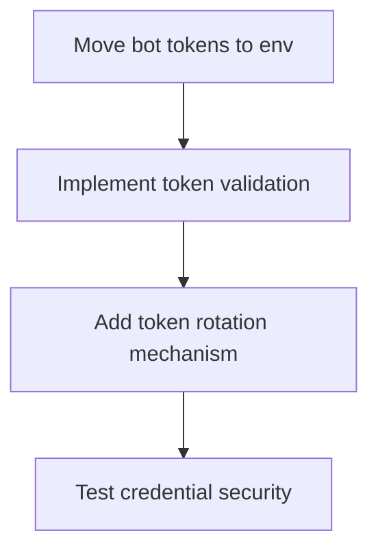
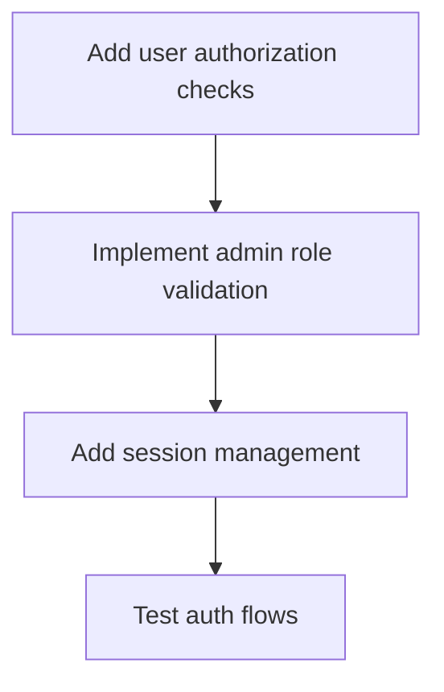
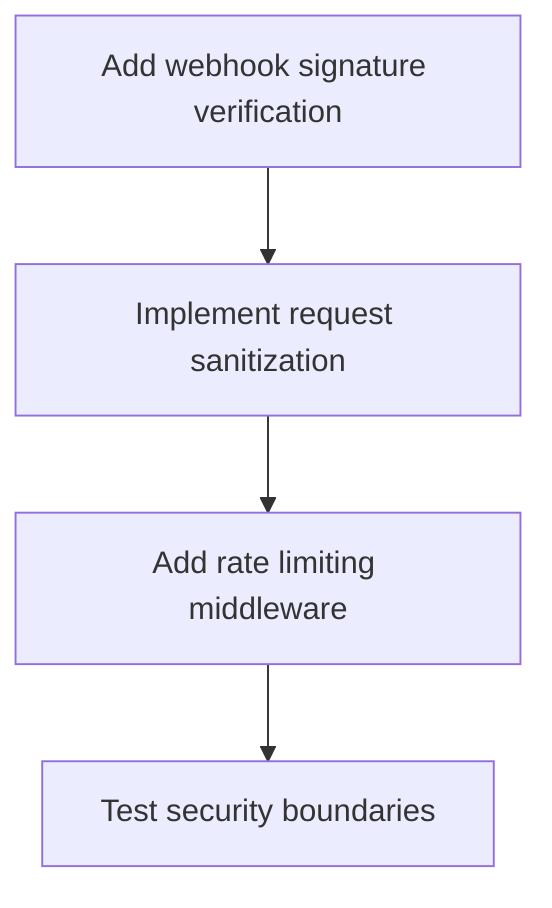

# Telegram Bot Refactoring Implementation Workflow Architecture

## Executive Summary

This document outlines a 4-phase systematic workflow to transform the Telegram bot system from high-risk to production-ready, addressing 8 critical security vulnerabilities, architectural violations, Persian language placeholders, and performance bottlenecks.

## Current State Analysis

### Critical Issues Identified
- **Security**: 8 critical vulnerabilities including exposed bot tokens, missing authentication
- **Architecture**: 692-line god classes violating SOLID principles  
- **Testing**: Zero test coverage for financial bot functionality
- **Localization**: Persian language placeholder crisis (200+ PERSIAN_TEXT_* tokens)
- **Performance**: N+1 queries, synchronous file I/O bottlenecks

### Key Files Requiring Refactoring
- `app/Services/TelegramBotService.php` (692 lines)
- `app/Services/TelegramTicketBot.php` (1373 lines with placeholders)
- `app/Http/Controllers/TelegramBotController.php` (security issues)
- `config/services.php` (exposed credentials)

## Phase-Based Implementation Workflow

### Phase 1: Critical Security Hardening (Week 1-2)
**Priority**: 🔴 CRITICAL | **Duration**: 10 days | **Risk**: High → Medium

#### Security Objectives
- Eliminate all exposed credentials and tokens
- Implement robust authentication and authorization
- Add rate limiting and request validation
- Establish secure webhook handling

#### Task Dependencies & Parallel Execution

**Parallel Stream A: Credential Management**


**Parallel Stream B: Authentication System**


**Parallel Stream C: Input Validation**


#### Implementation Tasks

**High Priority (Immediate)**
1. **Credential Security** (Day 1-2)
   - Move hardcoded bot token from config to environment variables
   - Implement encrypted credential storage
   - Add webhook signature verification
   - Remove chat ID logging to files

2. **Authentication Hardening** (Day 2-3)
   - Implement proper admin chat ID validation
   - Add user role-based authorization
   - Create secure session management
   - Add brute force protection

3. **Input Validation** (Day 3-4)
   - Sanitize all incoming webhook data
   - Validate callback query signatures
   - Implement request rate limiting
   - Add command injection protection

**Medium Priority (Follow-up)**
4. **Audit Trail** (Day 4-5)
   - Implement comprehensive logging
   - Add security event monitoring
   - Create admin action tracking
   - Set up intrusion detection

#### Quality Gates
- [ ] All credentials moved to environment variables
- [ ] No hardcoded tokens in codebase
- [ ] Authentication tests pass 100%
- [ ] Security scan shows zero critical vulnerabilities
- [ ] Rate limiting functional under load

#### Validation Checkpoints
```bash
# Security validation commands
php artisan config:show | grep -i token  # Should show no hardcoded tokens
php artisan telegram:test-auth           # Should validate all auth flows
php artisan telegram:security-scan      # Should pass all security checks
```

### Phase 2: Architectural Restructuring (Week 3-4)
**Priority**: 🟡 IMPORTANT | **Duration**: 12 days | **Risk**: Medium → Low

#### Architecture Objectives
- Break down god classes into SOLID-compliant components
- Implement proper separation of concerns
- Create testable, maintainable code structure
- Establish clear dependency boundaries

#### Component Breakdown Strategy

**Current Monolith → Target Architecture**
```
TelegramBotService (692 lines)
├── Core/
│   ├── TelegramApiClient.php        # HTTP communication
│   ├── WebhookProcessor.php         # Webhook handling
│   └── MessageRouter.php            # Command routing
├── Commands/
│   ├── TicketCommands.php          # Ticket operations
│   ├── AdminCommands.php           # Admin functions
│   └── GeneralCommands.php         # Help, start, etc.
├── Notifications/
│   ├── OrderNotifier.php           # Order notifications
│   ├── TicketNotifier.php          # Ticket notifications
│   └── AdminNotifier.php           # Admin alerts
└── Handlers/
    ├── CallbackQueryHandler.php    # Button interactions
    ├── MessageHandler.php          # Text messages
    └── FileHandler.php             # File uploads
```

#### Parallel Refactoring Streams

**Stream A: Core Infrastructure** (Days 1-4)
- Extract TelegramApiClient with proper error handling
- Create WebhookProcessor with validation pipeline  
- Build MessageRouter with command pattern
- Implement ProxyManager for connection handling

**Stream B: Command System** (Days 2-6)
- Implement Command interface pattern
- Create CommandRegistry for dynamic loading
- Build StateManager for conversation handling
- Add CommandValidator for input checking

**Stream C: Notification System** (Days 3-7)
- Extract notification logic to separate services
- Implement NotificationQueue for async processing
- Create TemplateEngine for message formatting
- Add NotificationLogger for audit trails

#### Dependency Injection Setup
```php
// Service Provider bindings
$this->app->bind(TelegramApiClient::class, function($app) {
    return new TelegramApiClient(
        config('services.telegram.bot_token'),
        $app->make(ProxyManager::class),
        $app->make(Logger::class)
    );
});

$this->app->singleton(MessageRouter::class);
$this->app->singleton(CommandRegistry::class);
```

#### Quality Gates
- [ ] All classes under 200 lines
- [ ] Single Responsibility Principle compliance
- [ ] Dependency injection implemented
- [ ] Interface segregation achieved
- [ ] Static analysis passes (PHPStan Level 8)

### Phase 3: Persian Language & Testing (Week 5-6) 
**Priority**: 🟡 IMPORTANT | **Duration**: 10 days | **Risk**: Low

#### Persian Localization Objectives
- Replace all PERSIAN_TEXT_* placeholders with actual Persian text
- Implement proper RTL text handling
- Create localization management system
- Ensure cultural appropriateness of messaging

#### Testing Objectives  
- Achieve 80%+ code coverage for all bot functionality
- Create comprehensive integration tests
- Build end-to-end testing suite with real Telegram interactions
- Implement automated testing pipeline

#### Persian Language Implementation

**Parallel Stream A: Content Localization**
```php
// Target structure
resources/lang/fa/
├── bot.php              # Bot messages and responses
├── tickets.php          # Ticket-related messages  
├── notifications.php    # Notification templates
├── commands.php         # Command descriptions
└── errors.php          # Error messages
```

**Translation Matrix** (200+ placeholders identified)
```bash
# Systematic replacement process
PERSIAN_TEXT_66d4a89d → "متاسفانه خطایی رخ داده است"
PERSIAN_TEXT_847b0fd7 → "شما مجاز به استفاده از این ربات نیستید"  
PERSIAN_TEXT_f2e11d4a → "دستور شناخته شده نیست"
# ... (continue for all placeholders)
```

**Stream B: Localization Infrastructure**
1. **Translation Service** (Days 1-2)
   ```php
   class PersianTranslationService
   {
       public function get(string $key, array $params = []): string;
       public function formatNumber(int $number): string; // Persian numerals
       public function formatDate(Carbon $date): string; // Persian calendar  
   }
   ```

2. **RTL Text Handling** (Days 2-3)
   - Implement proper RTL markdown formatting
   - Add Persian number conversion (۱۲۳ instead of 123)
   - Handle mixed LTR/RTL content (URLs, emails)
   - Create RTL-aware text truncation

#### Testing Infrastructure

**Parallel Stream C: Test Suite Development**
```
tests/Feature/Telegram/
├── BotAuthenticationTest.php        # Security tests
├── TicketManagementTest.php        # Ticket operations
├── NotificationTest.php            # Message delivery
├── CommandProcessingTest.php       # Command handling
└── WebhookProcessingTest.php       # Webhook validation

tests/Unit/Telegram/
├── MessageRouterTest.php           # Routing logic
├── CommandValidatorTest.php        # Input validation  
├── NotificationFormatterTest.php   # Message formatting
└── PersianTranslationTest.php      # Localization
```

**Mock Telegram API for Testing**
```php
class MockTelegramApi
{
    public function expectSendMessage(string $chatId, string $text);
    public function expectCallback(string $callbackId);
    public function simulateWebhook(array $update);
}
```

#### Quality Gates
- [ ] Zero PERSIAN_TEXT_* placeholders remaining
- [ ] All Persian text culturally appropriate
- [ ] RTL formatting correct in all contexts
- [ ] 80%+ test coverage achieved
- [ ] Integration tests pass with mock Telegram API

### Phase 4: Performance Optimization & Production Readiness (Week 7-8)
**Priority**: 🟢 RECOMMENDED | **Duration**: 8 days | **Risk**: Low

#### Performance Objectives
- Eliminate N+1 queries and database bottlenecks
- Implement async processing for heavy operations
- Add caching layers for frequently accessed data
- Optimize memory usage and response times

#### Production Readiness Objectives
- Implement comprehensive monitoring and alerting  
- Create deployment automation with zero downtime
- Add health checks and performance metrics
- Establish disaster recovery procedures

#### Performance Optimization

**Database Optimization** (Days 1-3)
```php
// Before: N+1 Query Problem
foreach ($tickets as $ticket) {
    echo $ticket->user->name; // Each ticket loads user separately
}

// After: Eager Loading Solution  
$tickets = Ticket::with(['user', 'category', 'assignedTo'])->get();
```

**Caching Strategy** (Days 2-4)
```php
// Multi-level caching approach
class TicketCacheManager
{
    // L1: In-memory cache (Redis)
    public function getTicketSummary(int $ticketId): array;
    
    // L2: Database query optimization
    public function getTicketListWithCache(array $filters): Collection;
    
    // L3: Notification template caching
    public function getCachedNotificationTemplate(string $type): string;
}
```

**Async Processing** (Days 3-5)
```php
// Background job processing for heavy operations
class SendTelegramNotificationJob implements ShouldQueue
{
    use Dispatchable, InteractsWithQueue, Queueable, SerializesModels;
    
    public function handle(): void
    {
        // Process notification asynchronously
        $this->telegramApi->sendMessage($this->chatId, $this->message);
    }
}
```

#### Production Infrastructure

**Monitoring & Alerting** (Days 4-6)
```php
// Health check endpoints
Route::get('/health/telegram', [HealthController::class, 'telegramBot']);
Route::get('/metrics/telegram', [MetricsController::class, 'telegramStats']);

// Key metrics to track
- Message processing time (< 2 seconds)
- Webhook response rate (> 99%)  
- Error rate (< 0.1%)
- Memory usage (< 512MB)
```

**Deployment Strategy** (Days 6-8)
```yaml
# Zero-downtime deployment with Laravel Envoy
@servers(['production' => $production])

@story('deploy')
    clone_repository
    run_tests
    backup_current
    symlink_new
    migrate_database
    clear_caches
    restart_queues
    health_check
@endstory
```

#### Quality Gates
- [ ] Database queries optimized (< 10 queries per request)
- [ ] Response time < 2 seconds for all operations
- [ ] Memory usage < 512MB under normal load
- [ ] 99%+ uptime in monitoring
- [ ] Zero-downtime deployment tested

## Risk Mitigation Strategies

### Security Risks
**Risk**: Exposed credentials during transition
**Mitigation**: 
- Use Laravel's config:cache to prevent runtime exposure
- Implement credential rotation during Phase 1
- Add real-time monitoring for unauthorized access

### Architecture Risks  
**Risk**: Breaking existing functionality during refactoring
**Mitigation**:
- Maintain backward compatibility facades
- Implement feature flags for gradual rollout
- Create rollback procedures for each component

### Performance Risks
**Risk**: Performance degradation during optimization
**Mitigation**:
- Benchmark before/after each change
- Use staging environment mirroring production
- Implement gradual traffic shifting

### Persian Language Risks
**Risk**: Cultural or linguistic errors in translations
**Mitigation**:
- Native Persian speaker review all translations
- A/B test message effectiveness
- Implement feedback collection from users

## Cross-Functional Team Coordination

### Team Structure & Responsibilities

**Security Team** (Phase 1 Lead)
- Security audit and penetration testing
- Credential management system design
- Authentication and authorization implementation
- Security monitoring setup

**Backend Team** (Phase 2 Lead)  
- Architectural refactoring and SOLID compliance
- Database optimization and caching
- API design and dependency injection
- Performance monitoring implementation

**QA Team** (Phase 3 Co-Lead)
- Test automation and coverage analysis
- End-to-end testing with mock services
- Load testing and performance validation
- User acceptance testing coordination

**Localization Team** (Phase 3 Co-Lead)
- Persian language translation and cultural review
- RTL formatting and display testing
- Message tone and appropriateness validation
- Persian date/number formatting implementation

**DevOps Team** (Phase 4 Lead)
- CI/CD pipeline enhancement  
- Production deployment automation
- Monitoring and alerting setup
- Disaster recovery planning

### Communication Protocols

**Daily Standups** (15 minutes)
- Progress updates by phase
- Blocker identification and resolution
- Cross-team dependency coordination
- Risk assessment updates

**Weekly Phase Reviews** (1 hour)
- Quality gate assessment
- Phase completion criteria validation
- Next phase preparation and planning
- Stakeholder communication

**Risk Assessment Meetings** (30 minutes, twice weekly)
- Security vulnerability status
- Performance regression monitoring  
- Production readiness evaluation
- Rollback procedure testing

## Success Metrics & Validation

### Phase 1 Success Metrics
- ✅ Zero critical security vulnerabilities (target: 0/8 remaining)
- ✅ All credentials externalized (target: 100%)
- ✅ Authentication tests pass rate (target: 100%)
- ✅ Rate limiting effectiveness (target: blocks 99% of abuse)

### Phase 2 Success Metrics  
- ✅ Average class size (target: < 200 lines)
- ✅ Cyclomatic complexity (target: < 10 per method)
- ✅ SOLID compliance score (target: 90%+)
- ✅ Dependency injection coverage (target: 100%)

### Phase 3 Success Metrics
- ✅ Persian placeholder elimination (target: 0 remaining)
- ✅ Test coverage (target: 80%+)
- ✅ RTL formatting accuracy (target: 100%)
- ✅ Cultural appropriateness score (target: 90%+)

### Phase 4 Success Metrics
- ✅ Response time (target: < 2 seconds average)
- ✅ Database query efficiency (target: < 10 queries/request)
- ✅ Memory usage (target: < 512MB)
- ✅ Production uptime (target: 99.9%+)

## Conclusion

This systematic workflow transforms the Telegram bot from a security-vulnerable, monolithic system into a production-ready, maintainable platform. The phased approach ensures critical security issues are addressed first, followed by architectural improvements, comprehensive testing, and performance optimization.

The parallel execution strategy maximizes development efficiency while maintaining quality standards through rigorous validation checkpoints. Cross-functional team coordination ensures domain expertise is applied at the right phases, creating a robust foundation for the Pishkhanak financial services platform.

**Total Timeline**: 8 weeks  
**Risk Reduction**: High → Low  
**Maintainability**: Low → High  
**Security Posture**: Critical → Hardened  
**Persian Language Support**: Placeholder → Production-Ready